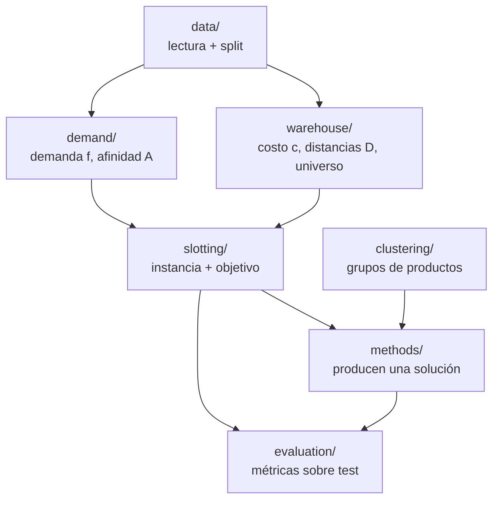

# ABS — Affinity-Based Slotting: mapa del proyecto

Esta carpeta documenta **qué hace el proyecto y cómo se conecta cada componente**,
con un nivel de detalle orientado a la comprensión del sistema más que a su
implementación interna. Para la formulación matemática rigurosa (QAP, programa
binario, derivaciones, análisis de escala) la referencia es
[formulacion.md](formulacion.md).

## El problema

En un centro de distribución, el costo dominante del armado de pedidos es el
**desplazamiento del operario** durante el picking. La asignación de productos a
ubicaciones (*slotting*) determina esos recorridos y, por lo tanto, la
productividad del depósito.

La práctica habitual asigna ubicaciones por disponibilidad de hueco o por
rotación individual de cada producto. Ese criterio ignora un patrón relevante:
los productos no se demandan de forma aislada. Existen pares que aparecen juntos
de manera recurrente en las mismas órdenes; si quedan ubicados lejos, generan
recorridos redundantes en cada pedido que los incluye.

El proyecto asigna ubicaciones combinando dos señales:

1. **Demanda** — la frecuencia con que se solicita cada producto. Los de mayor
   rotación deben quedar cerca de la zona de despacho.
2. **Afinidad** — la tendencia de ciertos productos a pedirse juntos. Los pares
   afines deben quedar próximos entre sí.

## Función objetivo

La calidad de una asignación se mide con una función de costo que pondera ambas
señales:

```
costo = λ · (demanda × distancia a la salida)
      + (1 - λ) · (afinidad × distancia entre productos)
```

- El **primer término** favorece ubicar los productos más demandados en las
  posiciones de menor costo de acceso.
- El **segundo término** favorece ubicar próximos a los productos que se demandan
  conjuntamente.
- **λ (lambda)** controla el peso relativo de cada término. Con λ=1 se ignora la
  afinidad; con λ=0 se ignora la demanda.

Esta función corresponde a un **QAP** (Quadratic Assignment Problem) en su forma
de Koopmans-Beckmann, un problema NP-hard que no admite resolución exacta a la
escala de este trabajo. Con unos 27.000 productos y 30.000 ubicaciones, una
formulación binaria tendría del orden de 8·10⁸ variables y la afinidad densa unas
7·10⁸ entradas.

## Estrategia de resolución

El QAP global no se resuelve de forma exacta: es intratable a esta escala. La
estrategia es **resolver un problema similar y tratable**, obtenido mediante dos
tipos de decisiones heurísticas de modelado:

- **Descomposición (bi-nivel).** En vez de un QAP de 27.000 productos, se agrupan
  los productos (clustering) y el problema se parte en dos: (1) ubicar cada grupo
  en una zona del depósito y (2) ubicar los productos dentro de cada zona. Cada
  subproblema es mucho más chico.
- **Truncado (top-k).** Se conservan solo los vínculos de afinidad más fuertes, lo
  que reduce el tamaño del término cuadrático.

Sobre ese problema reducido **sí se optimiza con solvers**: asignación lineal
exacta (Hungarian) y búsqueda local para los subproblemas a escala. Un solver de
optimización exacta (Gurobi) queda reservado para instancias chicas, como **óptimo
de referencia** contra el cual medir el *gap* de las heurísticas — no como
resolvedor del problema global.

Cómo construir cada componente (afinidad, distancias, demanda, costos), cómo
agrupar y truncar, y qué heurística usar son **variables de diseño experimental**
que se varían y comparan (ver [bloques.md](bloques.md)). Dos decisiones de
implementación sostienen el enfoque: la afinidad se almacena **dispersa** y los
movimientos de búsqueda se evalúan de forma **incremental**, sin recomputar el
costo completo.

## Alcance y simplificaciones

Para que las comparaciones sean honestas y el problema tratable, el trabajo adopta
explícitamente las siguientes simplificaciones:

- **Slotting estático.** Se decide una única asignación producto → ubicación; no se
  modelan reubicaciones a lo largo del tiempo.
- **Distancia a nivel bay.** Es la granularidad de los datos; el desplazamiento
  dentro de una bay no se modela (productos en la misma bay quedan a distancia
  cero).
- **Universo fijo de productos.** Se ubican todos los productos presentes en el
  stock inicial, lo que garantiza cobertura del 100% de lo que puede aparecer en
  test.
- **Recorrido serpenteante (snake), no TSP óptimo.** Se aproxima la política de
  ruteo real en lugar de resolver el recorrido óptimo de cada batch, para no
  confundir la calidad del *ruteo* con la del *slotting*.

## Los datos

El trabajo usa un dataset sintético de un depósito de zona única y 30 días de
actividad, compuesto por cinco tablas: coordenadas de bays, distancias camino
mínimo entre bays, stock inicial, eventos de picking y reposiciones. Magnitudes de
referencia:

| Concepto | Valor aproximado |
|----------|------------------|
| Eventos de picking (líneas) | 174.600 |
| Batches (viajes de picking) | 2.000 (~87 líneas cada uno) |
| Productos ubicados (SKUs) | 27.000 |
| Ubicaciones vacías | 3.000 |
| Bays | 1.000 + dock |
| Merchants (vendors) | 10 |

Las distancias vienen en pulgadas; la conversión a metros se usa solo para
reportar.

## El benchmark de referencia

El slotting vigente del depósito (`current`), evaluado sobre los 400 batches de
test, recorre en promedio **52.398 pulgadas por batch** (≈ 1.331 m). Ese valor es
la línea base contra la cual se mide toda estrategia posterior: una mejora se
expresa como reducción porcentual respecto de este número.

## Organización del código

El código reside en `src/abs_affinity_based_slotting/`, estructurado en capas. Las
dependencias son unidireccionales: cada capa depende solo de capas anteriores y
varias convergen en la siguiente.



El flujo de cualquier experimento es invariante: una instancia se resuelve con un
método para obtener una asignación, y el evaluador la juzga sobre test
(`instancia → método.solve → asignación → evaluador.evaluate → métricas`).

### Estructura del paquete

```
src/abs_affinity_based_slotting/
├── config.py            rutas y constantes del proyecto
├── registry.py          mecanismo generico nombre -> implementacion
│
├── data/                leer datos crudos y particionar train/test
│   ├── loaders.py       carga los 5 parquets
│   ├── schemas.py       valida columnas de cada tabla
│   ├── io.py            lee/escribe artefactos derivados
│   └── split.py         corte temporal train/test por batch
│
├── demand/              demanda f y afinidad A (desde train)
│   ├── sku_demand.py    demanda f por producto
│   ├── cooccurrence.py  co-ocurrencia n_ij y soporte s_i
│   ├── affinity.py      builders de afinidad + affinity_registry
│   └── filter.py        filtros de afinidad + filter_registry
│
├── warehouse/           geometria: costo c y distancias D
│   ├── locations.py     universo de productos desde el stock
│   ├── distances.py     distancias entre bays y al dock
│   └── costs.py         costo de acceso c por ubicacion
│
├── slotting/            el problema y su medicion
│   ├── instance.py      SlottingInstance (datos, inmutable, validado)
│   ├── build.py         construye la instancia desde las tablas
│   ├── assignment.py    Assignment (solucion; swap en O(1))
│   └── objective.py     slotting_cost y swap_delta
│
├── clustering/          agrupar productos (una etiqueta por producto)
│   ├── base.py          contrato ClusteringStrategy + clustering_registry
│   ├── abc.py           clases A/B/C por demanda
│   ├── merchant.py      una clase por vendor
│   └── affinity.py      componentes conexas de la afinidad
│
├── methods/             resolver: producir un Assignment
│   ├── base.py          contrato SlottingMethod + method_registry
│   ├── current.py       baseline: slotting vigente
│   ├── demand_greedy.py baseline por demanda (lambda=1)
│   ├── linear_assignment.py  exacto para lambda=1 (Hungarian)
│   └── local_search.py  heuristica de intercambios
│
└── evaluation/          medir una asignacion sobre test
    ├── routes.py        costo de un recorrido (orden snake)
    ├── metrics.py       metricas agregadas (media, mediana, p95)
    └── evaluator.py     orquesta el calculo sobre test
```

## Contenido de esta carpeta

- **[formulacion.md](formulacion.md)** — la formulación matemática rigurosa:
  notación, programa cuadrático binario, relación con el QAP, escala y evaluación
  incremental.
- **[pipeline.md](pipeline.md)** — recorrido por las capas: entradas, función y
  salidas de cada módulo, y la forma en que se encadenan.
- **[bloques.md](bloques.md)** — los componentes intercambiables (afinidad,
  filtro, clustering, método), su mecanismo de composición mediante *registries*,
  y el diseño del método bi-nivel.
- **[diseno-optimizacion.md](diseno-optimizacion.md)** — las alternativas de diseño
  del método (descomposición, Problema 1 y 2, afinidad inter-cluster, clustering),
  con ventajas, desventajas y la configuración elegida.

## Glosario

- **SKU** — producto distinto. **Location** — hueco físico exacto. **Bay** —
  columna de estantería; es la unidad de distancia. **Dock** — estación de empaque,
  inicio y fin de cada recorrido.
- **Batch** — conjunto de pedidos recolectados en una pasada; es la unidad de
  co-ocurrencia y de evaluación. **Picking** — recuperar ítems para una orden.
  **Slotting** — asignar una ubicación a cada producto.
- **Demanda (f)** — frecuencia con que se pide un producto. **Afinidad (a)** — grado
  en que dos productos se piden juntos. **Costo de acceso (c)** — distancia de una
  ubicación al dock.
- **Baseline** — método de referencia simple. **Heurística** — método aproximado,
  sin garantía de optimalidad. **Surrogate** — función de costo aproximada que guía
  la búsqueda, distinta de la métrica final de evaluación.
- **QAP** — Quadratic Assignment Problem; la familia a la que pertenece el problema,
  NP-hard.

## Documentos relacionados (en la raíz)

- [propuesta de tesis.md](../propuesta%20de%20tesis.md) — propuesta formal.
- [Resumen y punto de partida.md](../Resumen%20y%20punto%20de%20partida.md) — estado
  del arte y revisión de literatura.
