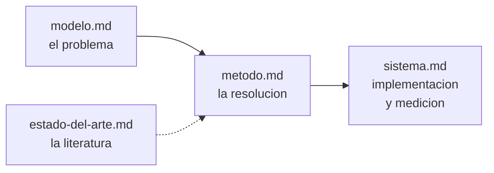

# Documentacion

**Affinity-Based Slotting**: asignacion de productos a ubicaciones de un deposito para
minimizar el desplazamiento del operario, combinando la frecuencia de demanda de cada
producto con la afinidad entre productos que se solicitan juntos.

La documentacion se organiza en cuatro documentos. Cada uno responde una pregunta y los
contenidos no se repiten entre ellos.

| Documento | Pregunta que responde |
|---|---|
| [modelo.md](modelo.md) | Que problema se resuelve, con que datos y bajo que formulacion |
| [metodo.md](metodo.md) | Como se resuelve y por que; alternativas evaluadas y descartadas |
| [sistema.md](sistema.md) | Como esta implementado y como se mide el desempeno |
| [estado-del-arte.md](estado-del-arte.md) | Que existe en la literatura y donde se ubica este trabajo |

[plan-de-trabajo.md](plan-de-trabajo.md) contiene la planificacion (etapas, horas,
cronograma); es un documento de gestion, no de referencia tecnica.

## Orden de lectura

Lectura completa: modelo, metodo, sistema, con el estado del arte como contexto del
metodo. Para trabajar sobre el codigo alcanza con modelo (secciones 1 y 4) y sistema.

## Indice tematico

| Contenido | Ubicacion |
|---|---|
| Magnitudes del dataset; particion train/test | [modelo.md, seccion 2](modelo.md#2-los-datos) |
| Benchmark de referencia | [modelo.md, seccion 3](modelo.md#3-benchmark-de-referencia) |
| Funcion objetivo, QAP, delta de intercambio | [modelo.md, seccion 4](modelo.md#4-formulacion-matematica) |
| Glosario | [modelo.md, seccion 6](modelo.md#6-glosario) |
| Descomposicion bi-nivel; alternativas descartadas | [metodo.md](metodo.md) |
| Capas del paquete; objetos centrales | [sistema.md, secciones 1 y 2](sistema.md#1-organizacion-en-capas) |
| Registries; como agregar un componente | [sistema.md, seccion 3](sistema.md#3-composicion-de-experimentos-registries) |
| Simulacion: reglas, politicas, estados iniciales | [sistema.md, seccion 7](sistema.md#7-la-simulacion) |
| Validacion del simulador | [sistema.md, seccion 8](sistema.md#8-validacion-del-simulador) |
| Resultados de referencia | [sistema.md, seccion 9](sistema.md#9-resultados-de-referencia) |

## Material relacionado, fuera de esta carpeta

- [propuesta de tesis.md](../propuesta%20de%20tesis.md): propuesta formal (directores,
  cronograma, bibliografia inicial).
- [estado-del-trabajo.md](../estado-del-trabajo.md): informe de situacion para la
  direccion.
- [notebooks/](../notebooks/): corridas y experimentos, numerados cronologicamente. No son
  codigo de produccion y pueden estar desactualizados respecto del paquete.
