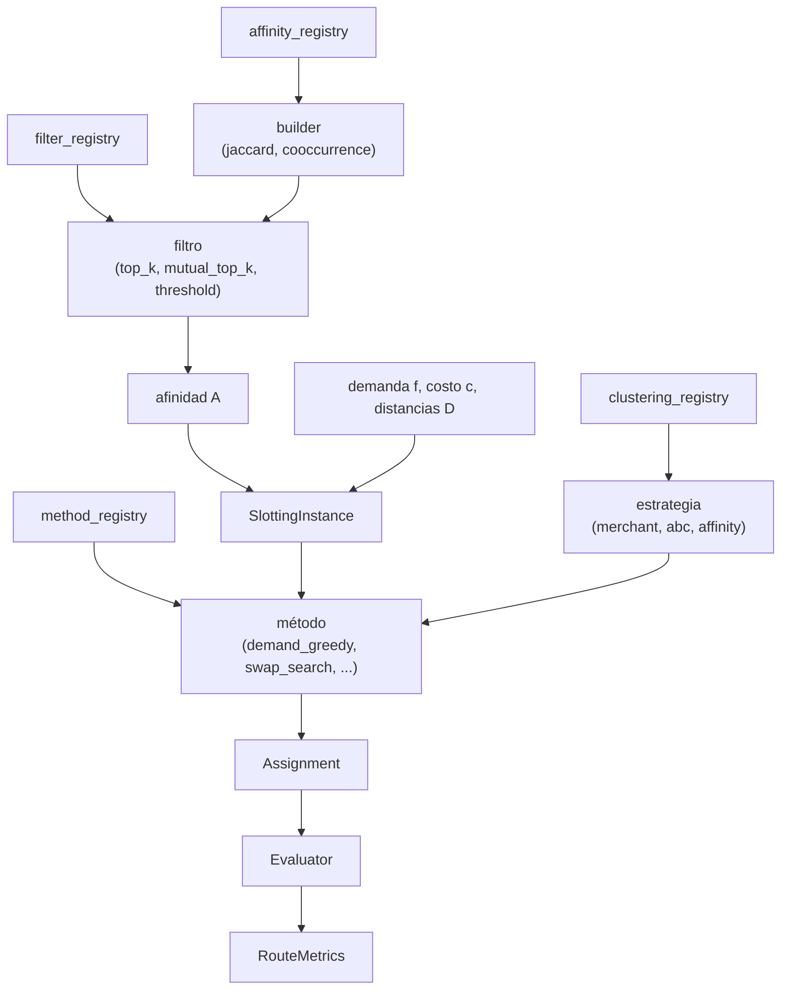

# Componentes intercambiables: el mecanismo de composición

El proyecto no se organiza en torno a un método fijo, sino a **componentes que se
combinan**. Un experimento se define eligiendo qué componente ocupa cada posición:

```
afinidad  →  filtro  →  clustering  →  método  →  (refinamiento por swaps)  →  evaluación
```

El objetivo de diseño es que cambiar de estrategia equivalga a cambiar una línea,
sin reescribir código. Este documento explica cómo se logra.

Cada familia de componentes proviene de su propio *registry*; las piezas elegidas
convergen en la instancia y en el método. No es una cadena rígida: la afinidad
alimenta a la instancia, el clustering alimenta al método, y cada uno se elige por
separado.



---

## Los registries: el mecanismo de composición

Un *registry* es un diccionario `nombre → implementación`. Cada familia de
componentes tiene el suyo. Registrar una implementación nueva requiere una línea
(un decorador), y a partir de entonces puede solicitarse por nombre.

```python
# en lugar de importar y acoplar la clase concreta:
from ...demand import JaccardAffinity
builder = JaccardAffinity()

# se solicita por nombre al registry:
builder = affinity_registry.get("jaccard")()
```

La ventaja es que el código de experimentos no referencia clases concretas:
probar otra métrica se reduce a sustituir `"jaccard"` por `"cosine"`. Esa
indirección es la que vuelve modular al pipeline. El mecanismo genérico reside en
`registry.py`.

---

## Las cuatro familias de componentes

### 1. Afinidad (`affinity_registry`) — cuantificar la co-demanda

Transforma las co-ocurrencias crudas en un puntaje de afinidad. Todas las métricas
derivan de los mismos tres ingredientes: la co-ocurrencia `n_ij` (batches con ambos
productos), el soporte `s_i` (batches con el producto `i`) y el total de batches.

| Nombre | Fórmula | Interpretación |
|--------|---------|----------------|
| `cooccurrence` | `a_ij = n_ij` | Conteo crudo; sesgado hacia productos frecuentes. |
| `jaccard` | `a_ij = n_ij / (s_i + s_j − n_ij)` | Solapamiento normalizado en [0, 1]; penaliza a los individualmente frecuentes. |

(Cosine, lift y otras métricas están previstas como extensiones; comparten la misma
base `n_ij`, `s_i`.) La elección de métrica es una variable de diseño experimental,
no una constante del problema.

### 2. Filtro (`filter_registry`) — conservar los vínculos relevantes

Reduce la densidad de la matriz de afinidad descartando vínculos débiles,
necesario para mantenerla dispersa y eficiente de recorrer.

| Nombre | Función |
|--------|---------|
| `top_k` | Por producto, conserva sus k vínculos más fuertes (simetrizado por unión). |
| `mutual_top_k` | Conserva un vínculo solo si ambos productos se seleccionan mutuamente. Más estricto. |
| `threshold` | Conserva los vínculos por encima de un valor mínimo. |

Todos devuelven una matriz **simétrica**, condición que el modelo exige y que la
instancia valida en su construcción.

### 3. Clustering (`clustering_registry`) — agrupar productos

Particiona el universo de productos en grupos. Devuelve una etiqueta por producto
(no una asignación). Constituye el nivel superior del método bi-nivel.

| Nombre | Criterio de agrupamiento | Nº de grupos |
|--------|--------------------------|--------------|
| `merchant` | vendor | ~10 |
| `demand_class` | tier de demanda (A/B/C) | 3 |

El clustering seleccionado **condiciona el comportamiento** del método bi-nivel:
`merchant` agrupa por vendor (criterio operativo) y `demand_class` por tier de
rotación (zonificación clásica de almacén). Es una variable de diseño experimental.

### 4. Método (`method_registry`) — producir la solución

Toma la instancia y devuelve una asignación.

| Nombre | Tipo | Usa afinidad |
|--------|------|--------------|
| `current` | baseline (slotting vigente) | no |
| `demand_greedy` | baseline constructivo | no |
| `linear_assignment` | exacto para λ=1 | no |
| `swap_search` | heurística de intercambios | sí |

---

## Composición de un experimento

Combinando los componentes:

```python
# 1. afinidad
A = affinity_registry.get("jaccard")().build(co.matrix, co.support, co.n_batches)

# 2. filtro
A = filter_registry.get("top_k")(k=10).filter(A)

# 3. instancia (integra A con la demanda y la geometria)
instance = build_instance(sku_demand, loc_costs, bay_distance,
                          initial_stock=stock, skus=universe, affinity=A)

# 4. metodo
method = method_registry.get("swap_search")(lam=0.3)
assignment = method.solve(instance)

# 5. evaluacion
metrics = evaluator.evaluate(assignment, picking_test)
```

Sustituir cualquier eslabón (otra métrica, otro filtro, otro método) se reduce a
cambiar un nombre o un parámetro.

---

## Objetivo y evaluador: dos medidas distintas

Conviene distinguir con precisión dos medidas que suelen confundirse:

| | Objetivo (`slotting_cost`) | Evaluador (`RouteMetrics`) |
|---|---|---|
| Propósito | guiar la búsqueda de los métodos | reportar el resultado |
| Datos | demanda y afinidad de **train** | recorridos sobre **test** |
| Naturaleza | una función analítica eficiente | una simulación de los recorridos |

Los métodos **optimizan el objetivo**; la evaluación **se realiza con el
evaluador**. La separación es deliberada: optimizar y medir con la misma función
produciría una estimación sesgada del desempeño. Es esperable que una reducción
del objetivo no se traduzca proporcionalmente en una reducción de la distancia
real; esa brecha es uno de los objetos de estudio del trabajo, e incluye la
elección adecuada de λ.

---

## Diseño del método bi-nivel

El método en construcción descompone el problema completo en subproblemas
tratables, y es el que confiere sentido al clustering:

```
Nivel superior:  agrupar productos (un ClusteringStrategy cualquiera)
                 → asignar cada grupo a una ZONA de ubicaciones
                   (resolviendo un QAP reducido: pocos grupos en lugar de 27.000 productos)

Nivel inferior:  dentro de cada zona, ubicar y refinar los productos del grupo
```

Fundamento:

- El clustering concentra la afinidad fuerte **dentro** de cada grupo. Esa
  componente se resuelve asignando a cada grupo una zona compacta.
- Entre grupos persiste afinidad residual (débil) junto con la demanda agregada.
  Esa componente se resuelve en el QAP del nivel superior, que al involucrar pocos
  grupos admite un tratamiento más cuidadoso.
- Las zonas se obtienen como rangos contiguos de bays ordenadas por distancia al
  dock, dimensionados según el tamaño de cada grupo.

El método tomará el `ClusteringStrategy` como parámetro, de modo que cualquier
estrategia del registry (merchant, demand_class) se integre sin modificaciones:

```python
BiLevelSlotting(clustering=clustering_registry.get("merchant")())
```

Cómo se resuelve cada subproblema depende de su tamaño:

- **Nivel superior** (pocos grupos): instancia chica, resoluble casi exacto por
  búsqueda local, o de forma exacta con un solver (Gurobi) para fijar el óptimo de
  referencia.
- **Nivel inferior** (dentro de cada zona): si solo pesa la demanda (λ=1), es una
  asignación lineal exacta (Hungarian, `scipy.linear_sum_assignment`); con afinidad,
  búsqueda local. Las zonas chicas también admiten el solver exacto.

Este enfoque reduce un QAP de 27.000 productos a un QAP de pocos grupos más un
conjunto de subproblemas independientes de menor tamaño, cada uno resoluble con la
herramienta adecuada a su escala. Constituye el aporte central del trabajo: la
descomposición es lo que vuelve aplicable la optimización donde el QAP global no lo
permite.
