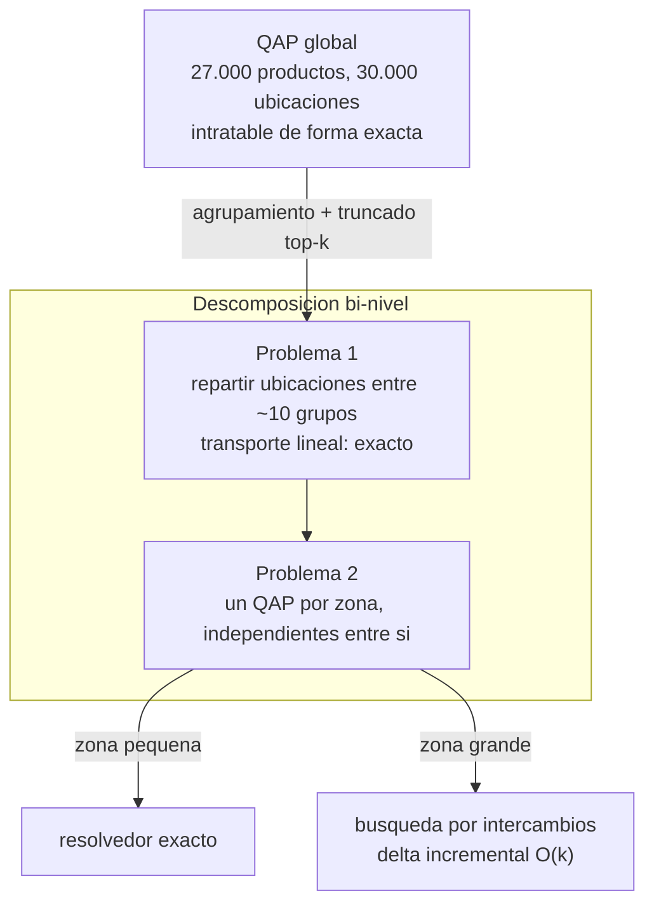

# Estrategia de resolucion

Documenta las decisiones de diseno del metodo: las alternativas consideradas en cada punto,
su evaluacion y la opcion adoptada. La formulacion del problema esta en
[modelo.md](modelo.md); la implementacion, en [sistema.md](sistema.md).

Estado de cada decision: **[adoptada]**, **[recomendada]** (pendiente de confirmacion) o
**[abierta]** (variable experimental).

---

## 1. Descomposicion del problema

El QAP global es intratable de forma exacta a esta escala
([modelo.md](modelo.md#43-relacion-con-el-qap-y-limite-de-escala)). La estrategia consiste
en resolver un problema aproximado y tratable.

| Alternativa | Idea | Ventaja | Desventaja | Estado |
|---|---|---|---|---|
| Descomposicion bi-nivel | agrupar productos; asignar zonas a los grupos y resolver el interior de cada zona | subproblemas de tamano reducido, independientes, optimizables de forma exacta | la calidad depende del agrupamiento; ignora parte de la estructura global | **[adoptada]** |
| Truncado top-k | conservar solo los vinculos de afinidad mas fuertes | reduce el termino cuadratico; complementa la anterior | descarta afinidad debil | **[adoptada]** |
| Relajacion del QAP global | resolver una relajacion (LP u otra) del problema completo | formulacion unica | dimension inalterada; cota potencialmente floja | descartada |



---

## 2. Problema 1: reparto de ubicaciones entre grupos

Asignar a cada grupo $c$ un conjunto de $\text{size}[c]$ ubicaciones.

| Alternativa | Modelo | Ventaja | Desventaja | Estado |
|---|---|---|---|---|
| A. Transporte lineal | $\min \sum \text{demanda}[c]\cdot\text{costo}[\ell]\cdot y_{\ell c}$ con $\sum_\ell y_{\ell c} = \text{size}[c]$, $\sum_c y_{\ell c} \le 1$ | lineal y exacto (matriz totalmente unimodular); la contiguidad resulta del orden por costo | usa demanda agregada como proxy; no considera afinidad entre grupos | **[recomendada]** |
| B. Regiones fijas con capacidad | particionar el deposito en regiones y asignar grupos con restriccion de capacidad | admite afinidad entre regiones | requiere definir las regiones; mayor complejidad | alternativa |
| C. Secuenciado de grupos | decidir el orden de los grupos sobre la linea ordenada por costo | representa zonas contiguas dimensionadas al grupo | el costo de cada bloque depende del orden acumulado; no es un QAP de coeficientes fijos | descartada |

La alternativa A se resuelve de forma exacta y economica; su optimo asigna las ubicaciones
de menor costo al grupo de mayor demanda agregada.

**Resolucion.** Se planteo como problema de optimizacion con solver, aunque el optimo
coincide con la forma cerrada de ordenar por demanda (verificado: ambos producen el mismo
costo). El planteo con solver generaliza al caso con afinidad entre grupos, que convierte
el problema en un QAP a nivel de grupo. **[adoptada]**

**Criterio de orden de las ubicaciones.** Determina la forma de las zonas. Medido sobre el
dataset:

| Criterio | Forma resultante | Dispersion media de la zona sobre el recorrido |
|---|---|---:|
| Distancia al dock | bandas concentricas | 10.402 |
| Posicion en el recorrido serpenteante | zonas contiguas | 2.202 |

Se adopta la posicion en el recorrido: produce zonas casi cinco veces mas compactas.
**[adoptada]**

---

## 3. Problema 2: resolucion de cada zona

Para cada grupo, sobre sus ubicaciones asignadas, se resuelve el QAP completo. Las zonas
son independientes entre si.

| Alternativa | Ambito | Ventaja | Desventaja | Estado |
|---|---|---|---|---|
| Resolvedor exacto | zonas pequenas | optimo probado; referencia de calidad | no escala (una zona por vendor, ~2.700 productos, excede el limite) | **[adoptada]** |
| Busqueda por intercambios | zonas grandes | escala mediante el delta incremental | sin garantia de optimalidad | **[adoptada]** |
| `scipy.quadratic_assignment` (FAQ) | — | sin requisito de licencia | heuristica distinta de la estudiada | descartada |

Regla: por zona, resolucion exacta si el tamano lo permite; busqueda por intercambios en
caso contrario. El umbral de tamano es un parametro a calibrar. **[abierta]**

---

## 4. Afinidad entre grupos

| Alternativa | Ventaja | Desventaja | Estado |
|---|---|---|---|
| Descartarla: la afinidad solo cuenta dentro de cada grupo | descomposicion simple; Problema 1 lineal | pierde el co-picking entre grupos | **[adoptada]** |
| Modelarla: QAP a nivel de grupo en el Problema 1 | captura el co-picking entre grupos | el Problema 1 deja de ser lineal | alternativa pendiente |

Con la afinidad entre grupos descartada, la responsabilidad de reunir los productos afines
recae por completo en el agrupamiento: dos productos co-demandados que caen en grupos
distintos no se optimizan entre si. La implementacion ya calcula la afinidad agregada
entre grupos y la descarta, de modo que incorporarla es una extension acotada.

---

## 5. Criterio de agrupamiento

| Agrupamiento | Grupos | Resultado medido |
|---|---|---|
| `merchant` (vendor) | ~10, balanceados | 10% peor que el baseline por demanda |
| `demand_class` (A/B/C) | 3 | equivalente al baseline (-0,3%, dentro del ruido) |
| Componentes conexas de la afinidad | 1 | degenerado: una componente de ~15.500 productos y miles de aislados; descartado |
| Deteccion de comunidades | — | pendiente de implementacion |

El agrupamiento por vendor, plan inicial del trabajo, resulta contraproducente: obliga a
distribuir los productos de alta rotacion de todos los vendors a lo largo del deposito. El
fenomeno coincide en magnitud con lo reportado en la literatura (Zhang 2016: la
zonificacion ABC resulta 10,28% peor que la asignacion por rotacion pura). La eleccion del
agrupamiento queda **[abierta]**; la deteccion de comunidades sobre el grafo de afinidad
filtrado es la alternativa a implementar.

---

## 6. Regimen de evaluacion

| Alternativa | Supuesto | Estado |
|---|---|---|
| Simulacion con reposiciones | el deposito cambia: los productos se mudan al agotarse su stock | **[adoptada]** |
| Evaluacion estatica | el plan se respeta indefinidamente (almacenamiento dedicado) | conservada como caso de comparacion |

La evaluacion estatica es el caso particular de la simulacion bajo la politica `home`;
la equivalencia esta verificada numericamente
([sistema.md](sistema.md#8-validacion-del-simulador)).

Decisiones asociadas:

- **Origen de las reposiciones**: se replican del dato (momento, producto y cantidad);
  solo se decide la ubicacion destino. Evita introducir supuestos sobre cuanto reponer.
- **Ambito de decision de la politica**: todas las reposiciones. Mantener la ubicacion
  actual es una decision mas de la politica.
- **Multiplicidad de ubicaciones**: un producto puede ocupar varias ubicaciones. Ocurre en
  el dato durante una mudanza y una politica puede producirlo.
- **Costo del re-slotting inicial**: excluido del objetivo y declarado, siguiendo la
  convencion del area para slotting estatico.

---

## 7. Configuracion vigente

```
Reduccion:     bi-nivel + truncado top-k
Problema 1:    transporte lineal, exacto
                 ubicaciones ordenadas por posicion en el recorrido (zonas compactas)
Problema 2:    QAP por zona, en paralelo
                 zona pequena -> resolvedor exacto
                 zona grande  -> busqueda por intercambios
Afinidad entre grupos: descartada (solo intra-zona)
Agrupamiento:  abierto; vendor descartado por resultado, comunidades pendiente
Evaluacion:    simulacion con reposiciones; estatica como comparacion
```

Decisiones abiertas: umbral de tamano del Problema 2, criterio de agrupamiento
definitivo, incorporacion de la afinidad entre grupos.
