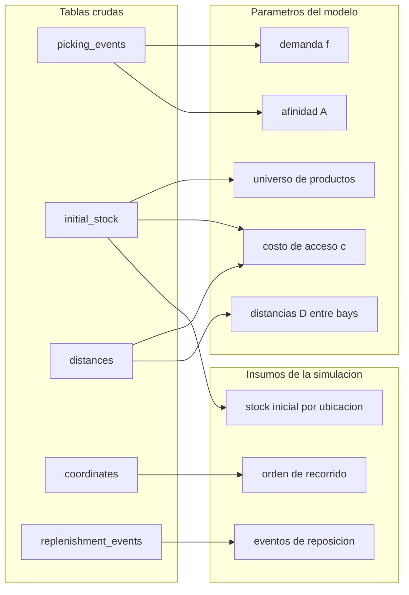
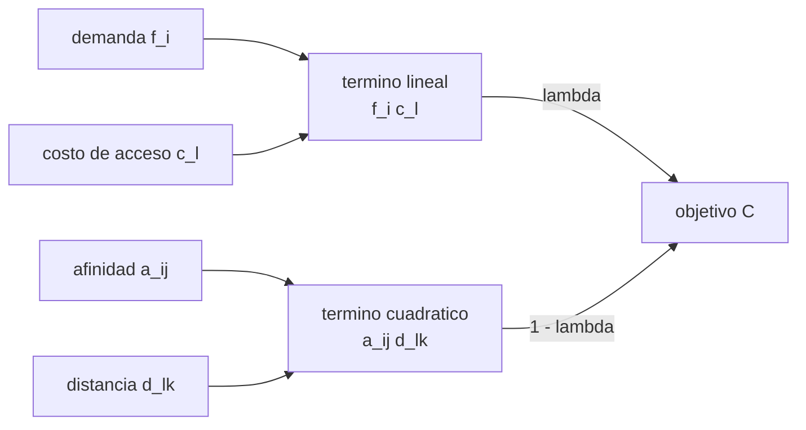

# El problema, los datos y el modelo

Define el problema, describe los datos y presenta la formulacion matematica. La estrategia
de resolucion esta en [metodo.md](metodo.md); la implementacion y el protocolo de medicion,
en [sistema.md](sistema.md).

---

## 1. El problema

En un centro de distribucion, el componente dominante del costo de preparar un pedido es
el desplazamiento del operario. La asignacion de productos a ubicaciones (*slotting*)
determina esos recorridos.

La practica habitual asigna ubicaciones por disponibilidad de hueco o por rotacion
individual de cada producto, sin considerar la relacion entre productos. Los pedidos
contienen pares de productos que aparecen juntos de forma recurrente; si esos pares quedan
almacenados lejos entre si, cada pedido que los incluye genera recorrido adicional.

El trabajo asigna ubicaciones combinando dos criterios en tension:

- **Demanda**: frecuencia con que se solicita cada producto. Los de mayor rotacion se
  ubican cerca de la zona de despacho.
- **Afinidad**: tendencia de dos productos a solicitarse juntos. Los pares afines se
  ubican proximos entre si, lo que puede alejar alguno del despacho.

Un parametro, lambda, pondera ambos criterios.

El problema pertenece a la familia **Storage Location Assignment Problem (SLAP)**, variante
*correlated storage assignment*. Su ubicacion en la literatura se desarrolla en
[estado-del-arte.md](estado-del-arte.md).

---

## 2. Los datos

Dataset sintetico, generado a partir de un deposito real. Zona unica, 30 dias de
actividad, cinco tablas parquet en `data/raw/`.

| Concepto | Valor |
|---|---|
| Lineas de picking | 174.597 |
| Batches (viajes de picking) | 2.000; ~87 lineas y ~76 productos distintos por batch |
| Ubicaciones | 30.000 (1.000 bays x 5 estantes x 6 bins) |
| Productos ubicados | 27.000; 3.000 huecos libres |
| Bays | 1.000 (25 pasillos x 40 bays), mas el dock |
| Merchants (vendors) | 10, balanceados (~2.700 productos cada uno) |
| Reposiciones | 14.647 (56% recarga in situ, 44% mudanza) |
| Pickers | 20, carga uniforme |

Las distancias son camino minimo (Dijkstra) sobre el grafo de pasillos, en pulgadas. La
conversion a metros se usa solo en los reportes.

### 2.1 De las tablas a los parametros

### 2.2 Particion train / test

Corte temporal a nivel de batch: cada batch se asigna integro a una particion segun su
timestamp; el 20% mas reciente constituye el test.

| Particion | Batches | Lineas | Productos observados |
|---|---:|---:|---:|
| Train | 1.600 | 139.632 | 15.554 |
| Test | 400 | 34.965 | — |

El corte se hace a nivel de batch porque el batch es la unidad de co-ocurrencia y de
evaluacion; partirlo introduciria fuga de informacion entre particiones.

De los 27.000 productos del universo, 11.446 no registran demanda en train e ingresan al
modelo con demanda cero.

Los eventos de reposicion requieren un corte propio, descrito en
[sistema.md](sistema.md#75-el-corte-de-las-reposiciones).

### 2.3 Caracterizacion exploratoria

Del notebook `00_EDA`: la ocupacion es uniforme por pasillo, bay, estante y vendor; la
actividad de picking es uniforme por pasillo y por numero de bay; pickers y merchants
estan balanceados. El dataset no presenta estructura espacial ni de demanda que sesgue el
analisis, y tampoco estructura explotable mas alla de la distancia al despacho.

---

## 3. Benchmark de referencia

Slotting vigente del deposito, evaluado sobre los 400 batches de test:

| Metrica | Pulgadas | Metros |
|---|---:|---:|
| Total | 20.959.192 | 532.363 |
| Media por batch | 52.398 | 1.331 |
| Mediana por batch | 52.540 | 1.335 |
| p95 por batch | 57.233 | 1.454 |

Toda estrategia se reporta como reduccion porcentual respecto de esta linea base.

---

## 4. Formulacion matematica

### 4.1 Notacion

| Simbolo | Significado |
|---|---|
| $I$, $n = \lvert I \rvert$ | conjunto de productos a ubicar |
| $L$, $m = \lvert L \rvert$ | conjunto de ubicaciones candidatas, $m \ge n$ |
| $f_i \ge 0$ | demanda del producto $i$ (*pick lines*) |
| $c_\ell \ge 0$ | costo de acceso de la ubicacion $\ell$ (distancia al dock) |
| $a_{ij} \ge 0$ | afinidad entre los productos $i, j$; simetrica, $a_{ii} = 0$ |
| $d_{\ell k} \ge 0$ | distancia entre las ubicaciones $\ell, k$ (via sus bays); simetrica, $d_{\ell\ell} = 0$ |
| $x_{i\ell} \in \{0, 1\}$ | vale $1$ si el producto $i$ se ubica en $\ell$ |
| $\lambda \in [0, 1]$ | peso relativo entre demanda-acceso y afinidad-proximidad |

### 4.2 Programa cuadratico binario

$$
\min_{x}\;\; \lambda \sum_{i \in I} \sum_{\ell \in L} f_i\, c_\ell\, x_{i\ell}
\;+\; (1 - \lambda) \sum_{i \in I} \sum_{j \in I} \sum_{\ell \in L} \sum_{k \in L}
a_{ij}\, d_{\ell k}\, x_{i\ell}\, x_{jk}
$$

sujeto a

$$
\sum_{\ell \in L} x_{i\ell} = 1 \quad \forall i \in I, \qquad
\sum_{i \in I} x_{i\ell} \le 1 \quad \forall \ell \in L, \qquad
x_{i\ell} \in \{0, 1\}.
$$

El termino lineal modela la colocacion de los productos frecuentes en posiciones de bajo
costo de acceso. El termino cuadratico penaliza la colocacion distante de productos con
alta afinidad: cada par $(i, j)$ aporta su afinidad multiplicada por la distancia entre
las ubicaciones asignadas. Las restricciones imponen que cada producto ocupe exactamente
una ubicacion y que cada ubicacion aloje a lo sumo un producto; la desigualdad admite
ubicaciones vacias.

### 4.3 Relacion con el QAP y limite de escala

Restringida a las $n$ ubicaciones utilizadas, una solucion factible asigna a cada producto
una unica ubicacion y el costo adopta la forma de Koopmans-Beckmann del **Quadratic
Assignment Problem**, con termino lineal. El QAP es NP-hard; Loiola et al. (2007) situan
el limite practico de la resolucion exacta en instancias de tamano 30.

A la escala de este problema, una formulacion directa tendria
$n \cdot m \approx 8{,}1 \times 10^{8}$ variables binarias y una afinidad densa de
$n^2 \approx 7{,}3 \times 10^{8}$ entradas. De alli dos decisiones que atraviesan la
implementacion:

1. **Afinidad dispersa**: $a_{ij}$ se almacena como matriz CSR restringida a los vinculos
   mas fuertes (top-$k$ por producto), reduciendo las entradas de $O(n^2)$ a $O(nk)$.
2. **Evaluacion incremental**: la busqueda local calcula la variacion de costo de cada
   movimiento, no el costo total.

### 4.4 Variacion de costo de un intercambio

Sea $\ell_i$ la ubicacion asignada al producto $i$. Al intercambiar las ubicaciones de dos
productos $a$ y $b$, la variacion $\Delta = C_{\text{despues}} - C_{\text{antes}}$ es,
con $a$ y $d$ simetricas y de diagonal nula:

$$
\Delta_{\text{lineal}} = (f_a - f_b)\,(c_{\ell_b} - c_{\ell_a}),
$$

$$
\Delta_{\text{cuad}} = 2 \sum_{k \neq a, b} (a_{ak} - a_{bk})\,
\bigl(d_{\ell_b, \ell_k} - d_{\ell_a, \ell_k}\bigr),
$$

$$
\Delta = \lambda\, \Delta_{\text{lineal}} + (1 - \lambda)\, \Delta_{\text{cuad}}.
$$

El factor $2$ cuenta cada par en sus dos ordenes y es valido por la simetria de $a$; la
instancia exige afinidad simetrica y lo valida en su construccion. El termino
$a_{ab}\, d_{\ell_a \ell_b}$ no varia por la simetria de $d$.

El calculo es $O(n)$ en el caso denso y $O(\deg(a) + \deg(b)) = O(k)$ con afinidad
top-$k$. Esta cota es la que hace viable la busqueda local a esta escala.

### 4.5 Costo marginal de una ubicacion

La politica de reposicion `objective_greedy`
([sistema.md](sistema.md#73-las-politicas-de-reposicion)) evalua el costo de colocar el
producto $s$ en la ubicacion $\ell$ dado el estado del deposito en ese instante:

$$
\text{costo}(\ell) = \lambda\, f_s\, c_\ell
\;+\; (1 - \lambda)\, 2 \sum_{j} a_{sj}\, \overline{d}(\ell, j)
$$

donde $j$ recorre los vecinos de afinidad de $s$ y $\overline{d}(\ell, j)$ es la distancia
media de $\ell$ a las ubicaciones que ocupa $j$ (un producto puede ocupar varias).

### 4.6 El objetivo como surrogate

$C$ guia la busqueda: se calcula sobre train y es barata de evaluar. El desempeno se
reporta con una medida distinta, la distancia de los recorridos simulados sobre test
([sistema.md](sistema.md#6-dos-medidas-distintas)). Optimizar y medir con la misma funcion
produciria una estimacion sesgada.

---

## 5. Alcance y simplificaciones

| Simplificacion | Implicacion |
|---|---|
| Distancia a nivel bay | Granularidad del dato. Dos productos en la misma bay quedan a distancia cero; el desplazamiento interno a la bay no se modela |
| Universo fijo de productos | Se ubican todos los presentes en el stock inicial; cobertura total de lo que aparece en test |
| Recorrido serpenteante, no TSP optimo | Aproxima la politica de ruteo real y separa la calidad del ruteo de la del slotting |
| Sin capacidad por ubicacion | El generador rellena "a capacidad" pero ninguna tabla exporta ese valor; al replicarse las cantidades del dato, los niveles la respetan por construccion |
| Sin costo de reposicion | Se contabiliza el desplazamiento del picker. El dataset no modela area de reserva, por lo que el recorrido del repositor no es derivable |

El trabajo comenzo con evaluacion estatica, que ignoraba las reposiciones. La evaluacion
vigente es una simulacion que las incorpora ([sistema.md](sistema.md#7-la-simulacion)).

---

## 6. Glosario

**Del deposito**

- **SKU** (producto): articulo distinto.
- **Location** (ubicacion): hueco fisico exacto, identificado por bay, estante y bin.
- **Bay**: columna de estanteria; unidad de distancia del modelo.
- **Dock**: estacion de empaque; inicio y fin de cada recorrido.
- **Batch**: conjunto de pedidos recolectados en una pasada; unidad de co-ocurrencia y de
  evaluacion.
- **Picking**: recoleccion de items para un pedido. **Slotting**: asignacion de una
  ubicacion a cada producto. **Reposicion**: reabastecimiento de stock, eventualmente con
  mudanza de ubicacion.

**Del modelo**

- **Demanda ($f$)**: frecuencia de solicitud de un producto, en *pick lines*.
- **Afinidad ($a$)**: grado en que dos productos se solicitan juntos.
- **Costo de acceso ($c$)**: distancia de una ubicacion al dock.
- **lambda**: peso relativo entre demanda y afinidad.
- **QAP**: Quadratic Assignment Problem. NP-hard.

**Del metodo**

- **Baseline**: metodo de referencia simple.
- **Heuristica**: metodo aproximado, sin garantia de optimalidad.
- **Surrogate**: funcion de costo que guia la busqueda, distinta de la metrica final.
- **Asignacion**: la propuesta producto-ubicacion que produce un metodo (el plan).
- **Estado**: el contenido fisico del deposito en un instante.
- **Politica de reposicion**: la regla que decide la ubicacion destino de las unidades
  repuestas.

---

## Referencias

- Koopmans, T.C. & Beckmann, M. (1957). *Assignment problems and the location of economic
  activities.* Econometrica, 25(1), 53-76.
- Loiola, E.M., de Abreu, N.M.M., Boaventura-Netto, P.O., Hahn, P. & Querido, T. (2007).
  *A survey for the quadratic assignment problem.* European Journal of Operational
  Research, 176(2), 657-690.
- Bartholdi, J.J. & Hackman, S.T. (2014). *Warehouse & Distribution Science* (Rel. 0.96).
  Georgia Institute of Technology.

La bibliografia del area esta en [estado-del-arte.md](estado-del-arte.md).
