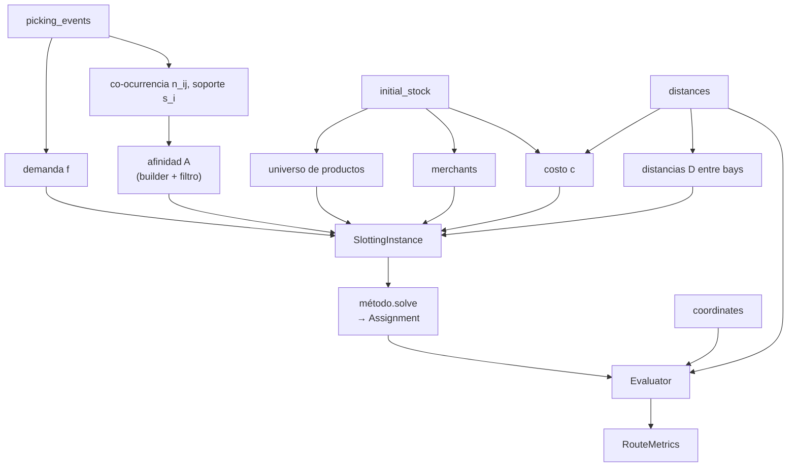

# El pipeline: las capas y el flujo de datos

Este documento recorre el código capa por capa. Para cada una se describe **qué
recibe, qué función cumple y qué entrega** a la siguiente, de modo de dejar claro
el camino completo desde los parquets crudos hasta las métricas finales.

Cada parámetro del modelo se deriva de una o más tablas crudas, y todos convergen
en la `SlottingInstance`. El diagrama muestra de qué se obtiene cada cosa (nótese,
por ejemplo, que el costo `c` requiere tanto el stock inicial como las distancias):



Principio rector: **la demanda y la afinidad se construyen únicamente con train; el
evaluador opera únicamente sobre test.** Esta separación evita una estimación
sesgada del desempeño.

---

## 1. `data/` — lectura y partición

**Recibe:** los cinco parquets crudos en `data/raw/`.
**Entrega:** las tablas en memoria y una partición train/test.

- `WarehouseDataLoader` lee los parquets (coordenadas, distancias, stock inicial,
  eventos de picking, reposiciones) y los expone en un `WarehouseDataset`.
- `split_picking_events` particiona el historial de picking en train y test. El
  corte es **temporal y a nivel de batch**: cada batch (un viaje de picking) se
  asigna íntegro a una partición según su timestamp, y la fracción más reciente
  constituye el test. Devuelve un `TemporalSplit` con `.train` y `.test`.

El corte a nivel de batch responde a que el batch es la unidad tanto de
co-ocurrencia como de evaluación. Partir un batch entre particiones introduciría
fuga de información. Con `test_size = 0.2`, los ~2.000 batches se reparten en
aproximadamente 1.600 de train y 400 de test.

---

## 2. `demand/` — demanda y co-demanda

**Recibe:** el picking de train y el universo de productos.
**Entrega:** el vector de demanda `f` y la matriz de afinidad `A`.

- `build_sku_demand` agrupa el picking por producto y cuenta sus *pick lines* (la
  cantidad de acciones de recolección de ese producto). Ese conteo define la
  demanda `f`.
- `build_cooccurrence` cuenta, para cada par de productos, en cuántos batches
  aparecen juntos (`n_ij`). Se obtiene de la matriz de incidencia binaria
  batch×producto `B` como `C = Bᵀ B`: su entrada `(i, j)` es la co-ocurrencia y su
  diagonal es el soporte `s_i` (en cuántos batches aparece cada producto). Es la
  materia prima de la afinidad.
- Un **builder de afinidad** transforma esas co-ocurrencias en un puntaje.
  Actualmente hay dos: `cooccurrence` (conteo crudo, `a_ij = n_ij`) y `jaccard`
  (`a_ij = n_ij / (s_i + s_j − n_ij)`, normalizado en [0, 1], que penaliza a los
  productos individualmente frecuentes).
- Un **filtro** reduce la densidad de la matriz conservando los vínculos más
  fuertes (`top_k`, `threshold`, `mutual_top_k`), lo que mantiene la afinidad
  dispersa y tratable.

> Builders y filtros son componentes intercambiables; se detallan en
> [bloques.md](bloques.md). La afinidad resultante **debe ser simétrica**
> (`a_ij = a_ji`), condición que impone el modelo y que los filtros preservan.

---

## 3. `warehouse/` — geometría del depósito

**Recibe:** el stock inicial y la tabla de distancias.
**Entrega:** el costo `c` de cada ubicación y la matriz `D` de distancias.

- `occupied_locations` define el **universo de productos**: todos los que ocupan
  alguna ubicación en el stock inicial (unos 27.000). Es fijo y garantiza
  cobertura del 100% de los productos que pueden aparecer en test.
- `build_location_costs` calcula el costo `c` de cada ubicación como la distancia
  de su bay al dock. Menor distancia implica menor costo de acceso.
- `build_bay_distance_matrix` construye la matriz `D` de distancias entre bays.

La granularidad es a nivel **bay** (no de estante individual), tal como provienen
los datos. Dos productos en la misma bay quedan a distancia cero.

---

## 4. `slotting/` — el problema y su medición

Es la capa central. Integra todo lo anterior en un objeto y define cómo se mide
una solución.

**`SlottingInstance`** — los datos del problema, ya en forma numérica e inmutable.
Contiene `f`, `c`, `D`, `A` y los identificadores de productos, ubicaciones y
bays. La construye `build_instance` (o `build_full_instance`, que encadena
los pasos de demand/ y warehouse/ en una sola llamada). En su construcción
**valida** la consistencia de los datos (dimensiones, ausencia de NaN, simetría de
la afinidad, entre otros): ante cualquier inconsistencia falla de inmediato, en
lugar de propagar resultados incorrectos.

**`Assignment`** — una solución, es decir el mapa producto → ubicación. Su diseño
permite intercambiar dos productos en tiempo constante, operación central de la
búsqueda local.

**`objective`** — la medición de una asignación:
- `slotting_cost` calcula el costo total `C = λ·L + (1-λ)·Q`.
- `swap_cost_delta` calcula la **variación** de costo al intercambiar dos productos sin
  recomputar la suma completa. Esta evaluación incremental es lo que vuelve viable
  la búsqueda local.

---

## 5. `methods/` — resolución del problema

**Recibe:** una `SlottingInstance`.
**Entrega:** un `Assignment` (la solución propuesta).

Todos los métodos comparten la misma interfaz (`solve(instance) → Assignment`), lo
que permite tratarlos de forma uniforme. Disponibles actualmente:

- `current` — el slotting vigente del depósito (leído del stock inicial). Es el
  baseline de referencia.
- `demand_greedy` — empareja productos ordenados por demanda con ubicaciones
  ordenadas por costo. Ignora la afinidad (equivale a λ=1). Simple pero competitivo.
- `linear_assignment` — resuelve de forma exacta el caso λ=1 (asignación lineal,
  algoritmo húngaro). Sirve como validación y cota frente al greedy.
- `swap_search` — parte de una solución inicial y la mejora intercambiando pares
  de productos mientras el costo disminuya. Es el primer método que aprovecha la
  afinidad.

> El método **bi-nivel** (clustering + zonas) se encuentra en construcción; su
> diseño se describe en [bloques.md](bloques.md).

---

## 6. `evaluation/` — la medición sobre test

**Recibe:** un `Assignment` y el picking de test.
**Entrega:** las métricas de desempeño.

- `Evaluator` toma la asignación y, para cada batch de test, simula el recorrido:
  ordena las bays a visitar en orden serpenteante (*snake*, por pasillo y número de
  bay) y suma la distancia dock → productos → dock. Si las bays ordenadas son
  `b₁, …, b_T`, el costo del recorrido es

  ```
  R = D₀(dock, b₁) + Σ D(b_t, b_{t+1}) + D₀(b_T, dock)
  ```

  El orden de visita se **recalcula** según las ubicaciones que propone la
  asignación (no según el orden histórico de picking), para que la comparación
  entre estrategias sea consistente. Picks en la misma bay no agregan distancia.
- Previo a medir, verifica el **invariante de cobertura**: todo producto presente
  en test debe estar ubicado. Un producto sin ubicar genera un error explícito.
- `RouteMetrics` resume los recorridos de todos los batches: total, media, mediana y
  percentil 95.

El evaluador es **independiente del método** que generó la asignación, lo que
preserva la imparcialidad de la comparación.

---

## El contrato entre capas

El sistema se articula en torno a tres objetos que se transfieren entre capas:

```
SlottingInstance   (el problema)   →   construido por slotting/build
      │
      ▼  método.solve
Assignment         (la solución)   →   producido por methods/
      │
      ▼  evaluador.evaluate
RouteMetrics            (el veredicto)   →   producido por evaluation/
```

Mientras un componente respete su contrato (recibir una instancia, devolver una
asignación), se integra en el pipeline sin requerir cambios en el resto. Sobre esa
propiedad se construye la modularidad descrita en el siguiente documento.
