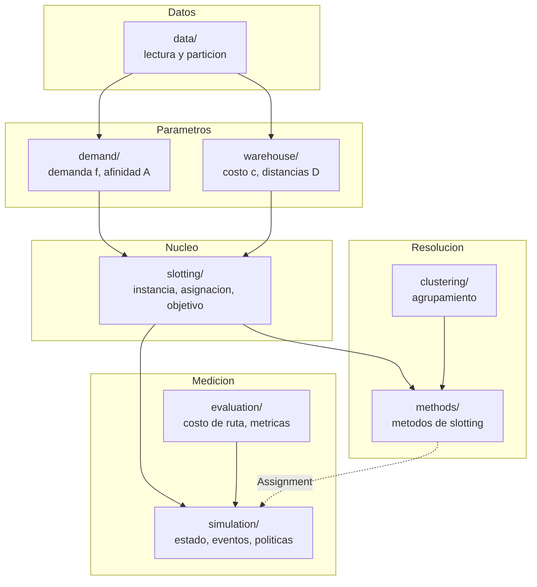
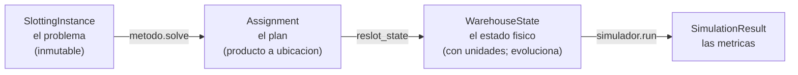
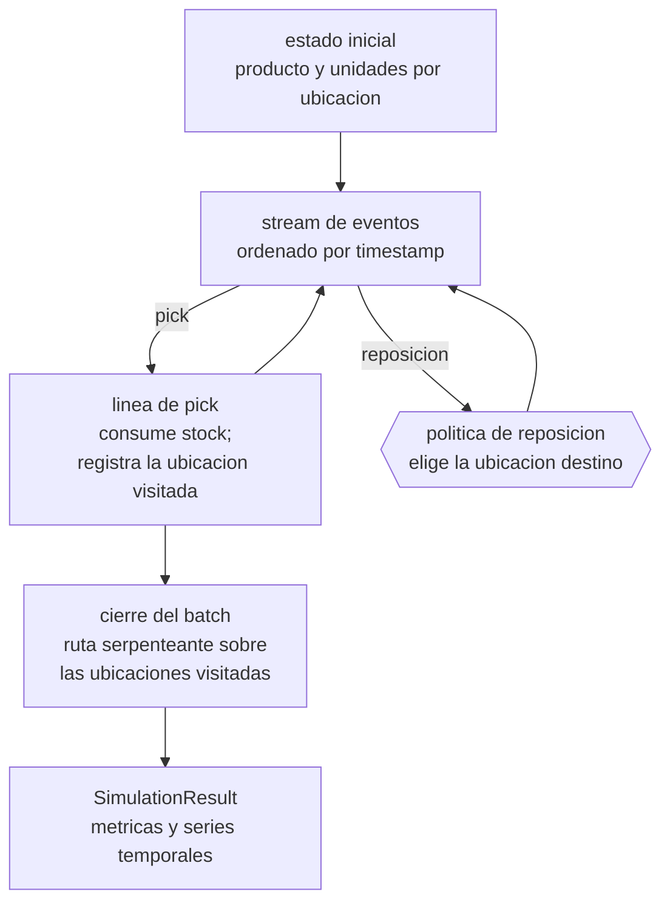

# Implementacion y protocolo de medicion

Describe la organizacion del codigo, los objetos centrales, el mecanismo de composicion de
experimentos y el protocolo de evaluacion, incluida la simulacion. El problema y su
formulacion estan en [modelo.md](modelo.md); la justificacion del metodo, en
[metodo.md](metodo.md).

---

## 1. Organizacion en capas

El paquete reside en `src/abs_affinity_based_slotting/`. Las dependencias son
unidireccionales: cada capa depende unicamente de capas anteriores.



| Capa | Entrada | Salida |
|---|---|---|
| `data/` | parquets crudos | tablas en memoria; particion train/test |
| `demand/` | picking de train | vector de demanda `f`; matriz de afinidad `A` |
| `warehouse/` | stock inicial; distancias | costo `c` por ubicacion; matriz `D` entre bays |
| `slotting/` | lo anterior | `SlottingInstance`; funcion de costo |
| `clustering/` | una instancia | una etiqueta de grupo por producto |
| `methods/` | una instancia | un `Assignment` |
| `evaluation/` | bays y distancias | costo de un recorrido; metricas agregadas |
| `simulation/` | instancia, eventos, plan | desempeno bajo la dinamica de reposiciones |

---

## 2. Objetos centrales

Tres objetos se transfieren entre capas.



**`SlottingInstance`**: los datos del problema en forma numerica. Contiene `f`, `c`, `D`,
`A` y los identificadores de productos, ubicaciones y bays. En su construccion valida
dimensiones, ausencia de NaN y simetria de la afinidad; ante una inconsistencia falla de
inmediato. Internamente opera con posiciones enteras; los identificadores externos se
conservan para interpretacion.

**`Assignment`**: la solucion que produce un metodo, un mapa producto-ubicacion. Admite el
intercambio de dos productos en tiempo constante, operacion central de la busqueda local.

**`WarehouseState`**: el contenido fisico del deposito en un instante — que producto ocupa
cada ubicacion y con cuantas unidades. Es el objeto que evoluciona durante la simulacion.
Un producto puede ocupar varias ubicaciones; una ubicacion aloja a lo sumo un producto.

La distincion entre `Assignment` y `WarehouseState` es estructural: el primero es el plan,
sin unidades y sin dinamica; el segundo es la realidad operativa.

---

## 3. Composicion de experimentos: registries

Cada familia de componentes se registra en un diccionario `nombre -> implementacion`
(`registry.py`). El codigo experimental solicita los componentes por nombre, sin acoplarse
a clases concretas.

```python
builder = affinity_registry.get("jaccard")()
```

### Familias disponibles

**Afinidad** (`affinity_registry`) — convierte co-ocurrencias en un puntaje. Insumos: la
co-ocurrencia `n_ij`, el soporte `s_i` y el total de batches.

| Nombre | Formula | Caracteristica |
|---|---|---|
| `cooccurrence` | $n_{ij}$ | conteo crudo; sesgado hacia productos frecuentes |
| `jaccard` | $n_{ij} / (s_i + s_j - n_{ij})$ | normalizado en [0,1]; penaliza los individualmente frecuentes |
| `cosine` | $n_{ij} / \sqrt{s_i s_j}$ | normaliza por la media geometrica de los soportes |

**Filtro** (`filter_registry`) — reduce la densidad de `A` conservando los vinculos
fuertes. Todos devuelven una matriz simetrica.

| Nombre | Funcion |
|---|---|
| `top_k` | conserva los k vinculos mas fuertes por producto; simetrizacion por union |
| `mutual_top_k` | conserva un vinculo solo si ambos productos se seleccionan mutuamente |
| `threshold` | conserva los vinculos que superan un valor minimo |

**Clustering** (`clustering_registry`) — particiona los productos en grupos.

| Nombre | Criterio | Grupos |
|---|---|---|
| `merchant` | vendor | ~10 |
| `demand_class` | clase de demanda A/B/C | 3 |

**Metodo** (`method_registry`) — produce un `Assignment` a partir de una instancia.

| Nombre | Tipo | Usa afinidad |
|---|---|---|
| `current` | baseline: slotting vigente, leido del stock inicial | no |
| `demand_greedy` | baseline constructivo: productos por demanda contra ubicaciones por costo | no |
| `linear_assignment` | exacto para lambda igual a 1 (algoritmo hungaro) | no |
| `swap_search` | busqueda local por intercambios sobre una solucion semilla | si |
| `bilevel` | dos etapas: reparto de zonas y resolucion por zona | si |
| `exact_qap` | resolvedor exacto del QAP; instancias pequenas | si |

**Politica de reposicion** (`replenishment_policy_registry`) — decide la ubicacion destino
de cada reposicion durante la simulacion (seccion 7.3).

### Ejemplo de composicion

```python
A = affinity_registry.get("jaccard")().build(co.matrix, co.support, co.n_batches)
A = filter_registry.get("top_k")(k=10).filter(A)
instance = build_instance(sku_demand, loc_costs, bay_distance,
                          initial_stock=stock, skus=universe, affinity=A)
assignment = method_registry.get("swap_search")(lam=0.3).solve(instance)
result = simulator.run(state, events, policy, planned=assignment)
```

---

## 4. Estructura del paquete

```
src/abs_affinity_based_slotting/
├── config.py            rutas y constantes
├── registry.py          mecanismo nombre -> implementacion
│
├── data/
│   ├── loaders.py       carga de los 5 parquets
│   └── split.py         corte temporal train/test por batch
│
├── demand/
│   ├── sku_demand.py    demanda f por producto
│   ├── cooccurrence.py  co-ocurrencia n_ij y soporte s_i
│   ├── affinity.py      builders de afinidad + registry
│   └── filter.py        filtros + registry
│
├── warehouse/
│   ├── locations.py     universo de productos
│   ├── distances.py     distancias entre bays y al dock
│   └── costs.py         costo de acceso por ubicacion
│
├── slotting/
│   ├── instance.py      SlottingInstance
│   ├── build.py         construccion de la instancia
│   ├── assignment.py    Assignment
│   └── objective.py     slotting_cost y swap_cost_delta
│
├── clustering/
│   ├── base.py          contrato + registry
│   ├── abc.py           clases A/B/C por demanda
│   └── merchant.py      un grupo por vendor
│
├── methods/
│   ├── base.py          contrato SlottingMethod + registry
│   ├── current.py       slotting vigente
│   ├── demand_greedy.py baseline por demanda
│   ├── linear_assignment.py  exacto para lambda igual a 1
│   ├── local_search.py  busqueda por intercambios
│   ├── two_stage.py     metodo bi-nivel
│   └── exact.py         resolvedor exacto del QAP
│
├── evaluation/
│   ├── routes.py        orden serpenteante; costo de una ruta
│   ├── metrics.py       metricas agregadas
│   └── evaluator.py     evaluador estatico
│
└── simulation/
    ├── state.py         WarehouseState y pool de huecos libres
    ├── events.py        tablas -> stream de eventos; corte de reposiciones
    ├── base.py          contrato de politica + registry
    ├── random_storage.py politica de hueco libre al azar
    ├── home.py          politica que mantiene el plan
    ├── objective_greedy.py  politica que minimiza el costo marginal
    ├── initial_state.py estados iniciales; regla de picking
    ├── simulator.py     bucle de eventos
    └── results.py       SimulationResult
```

---

## 5. Convenciones

- **Nucleo numerico por posiciones.** En `slotting/` y `simulation/` se opera con indices
  enteros, numpy y scipy. Pandas aparece solo en los bordes: lectura de datos y
  exportacion de resultados.
- **Nombres por funcion, no por herramienta.** El resolvedor exacto se denomina `exact`;
  su entorno, `make_solver_env`. Un cambio de herramienta no invalida los nombres.
- **Un subpaquete por concepto.**
- **Fallo temprano.** Las validaciones lanzan excepcion ante datos inconsistentes. La
  excepcion son los faltantes de stock en la simulacion, que constituyen dinamica
  legitima y se contabilizan.

---

## 6. Dos medidas distintas

| | Objetivo (`slotting_cost`) | Evaluacion (distancia de rutas) |
|---|---|---|
| Funcion | guiar la busqueda de los metodos | reportar el desempeno |
| Datos | demanda y afinidad de train | recorridos sobre test |
| Naturaleza | funcion analitica | simulacion de la operacion |

Los metodos optimizan el objetivo; el desempeno se mide con la simulacion. La brecha entre
ambas medidas es objeto de estudio; se registro un caso en que la busqueda local redujo el
objetivo y aumento la distancia (26.079 a 26.964, lambda igual a 0,5).

### Costo de un recorrido

Para un batch: se toman los productos solicitados y sus ubicaciones en ese momento; las
bays a visitar se ordenan en orden serpenteante (pasillo, numero de bay); se suma la
distancia dock, bays en ese orden, dock.

$$
R = D(\text{dock}, b_1) + \sum_t D(b_t, b_{t+1}) + D(b_T, \text{dock})
$$

Picks en la misma bay no agregan distancia. El orden de visita se recalcula segun la
ubicacion vigente de cada producto; no se usa el orden historico. `RouteMetrics` agrega
total, media, mediana y percentil 95 sobre los batches.

### Evaluador estatico

Fija una asignacion y mide cada batch de test contra ella, suponiendo que el deposito no
cambia. Verifica previamente el invariante de cobertura: todo producto presente en test
debe estar ubicado; en caso contrario lanza excepcion. Equivale a suponer almacenamiento
dedicado y sobrestima el desempeno de una estrategia optimizada. Se conserva como caso de
comparacion.

---

## 7. La simulacion

Evaluacion principal del trabajo. Parte de un estado del deposito y procesa los eventos en
orden temporal.



De cada reposicion, el dato aporta el momento, el producto y la cantidad; la simulacion
decide unicamente la ubicacion destino. Esa decision corresponde a la politica de
reposicion, y es el punto donde interviene el algoritmo de slotting.

### 7.1 Regla de picking

Cuando un producto ocupa varias ubicaciones, el picker acude a la de menor stock que cubra
la linea; si ninguna la cubre por si sola, recolecta de varias en orden creciente de
stock. El faltante que el stock no cubre se contabiliza, sin excepcion. Una ubicacion
drenada a cero se libera si el producto conserva otra; la unica ubicacion de un producto
no se libera.

### 7.2 Intercalado de eventos

Las lineas de pick y las reposiciones se intercalan a sus timestamps exactos. El generador
del dataset inserta cada reposicion inmediatamente antes de la linea que la dispara; un
intercalado mas grueso (por ejemplo, aplicar las reposiciones al inicio del batch)
encuentra al producto con stock y convierte mudanzas en recargas in situ, subestimando los
quiebres.

### 7.3 Las politicas de reposicion

Contrato: `choose_destination(evento, estado, contexto) -> ubicacion`. El simulador valida
que la respuesta sea un hueco libre o una ubicacion que el producto ya ocupa.

| Politica | Comportamiento | Modela |
|---|---|---|
| `random` | recarga en la ubicacion actual; ante quiebre de stock, muda a un hueco libre al azar (probabilidad 0,9) | deposito sin plan de slotting; coincide con la generacion del dataset |
| `home` | entrega en la ubicacion asignada por el plan; si esta ocupada, en el hueco libre mas cercano a ella | sistema que conoce y mantiene el plan |
| `objective_greedy` | entrega en la ubicacion de minimo costo marginal del objetivo, dado el estado vigente ([modelo.md](modelo.md#45-costo-marginal-de-una-ubicacion)) | decision en linea del algoritmo |

### 7.4 Estados iniciales

| Funcion | Produce |
|---|---|
| `state_from_initial_stock` | el estado del dia cero |
| `state_after_history` | el estado posterior a una historia registrada; se usa para obtener el estado real en el corte train/test |
| `reslot_state` | el estado resultante de aplicar un plan como re-slotting completo, trasladando cada producto con sus unidades |

`state_after_history` no procesa los eventos uno a uno: deriva el estado por aritmetica
(stock inicial mas entregas menos picks, por ubicacion), con reglas de propiedad basadas
en la ultima reposicion. Esto lo hace inmune a las inconsistencias de timestamps del dato,
en el que una mudanza puede registrarse despues de picks que ya la presuponen.

El baseline `current` se simula desde el estado real en el corte, no desde la foto del dia
cero; la version anterior compararaba contra un layout que ya no estaba vigente durante el
periodo de prueba.

### 7.5 El corte de las reposiciones

Un corte por fecha deja ubicaciones con balance negativo: las mudanzas se registran con
posterioridad al movimiento fisico, de modo que los picks pueden quedar en train y las
unidades que los sirvieron en test. `split_replenishments` corrige el borde: toda
ubicacion cuyo stock de train resultaria negativo recupera su reposicion mas temprana de
test, iterando hasta que el balance cierra.

### 7.6 Salidas

- `route_metrics`: total, media, mediana y p95; comparables con el evaluador estatico.
- `batch_log`: una fila por batch en orden temporal; serie para el analisis de
  degradacion.
- `replen_log`: una fila por reposicion, con destino, indicador de mudanza e indicador de
  entrega en la ubicacion planificada.
- Contadores: mudanzas, faltantes, fraccion de productos fuera de su ubicacion
  planificada.

---

## 8. Validacion del simulador

| Control | Criterio | Resultado |
|---|---|---|
| Reproduccion de la historia completa | 6.452 mudanzas del dato; stock final por producto igual a un calculo independiente en pandas | exacto |
| Politica `home` sobre un plan factible | sin movimientos; identico al evaluador estatico | exacto (26.079) |
| Quiebres de stock en test | iguales a los del dato | exacto (1.362 = 1.362) |
| `reslot_state` | conservacion de unidades por producto | exacto |
| Invariantes del estado | ocupadas mas libres = 30.000; sin unidades negativas; sin doble propietario | correcto |

El segundo control establece que el evaluador estatico es el caso particular de la
simulacion en que el plan se respeta.

**Diferencia residual conocida.** El dato registra 1.371 mudanzas en test; la simulacion
produce 1.226. La descomposicion: 15 corresponden a la varianza del sorteo (probabilidad
0,9 sobre 1.362 quiebres) y 130 son mudanzas que el generador ejecuta sin quiebre de
stock, comportamiento que su documentacion no describe (de los 1.362 quiebres, el dato
muda 1.241, el 91,1%, consistente con la probabilidad declarada). Al omitir esos
movimientos adicionales, la degradacion medida es conservadora.

---

## 9. Resultados de referencia

Sobre los 400 batches de test, con semilla fija:

| Escenario | Media por batch | Mudanzas |
|---|---:|---:|
| Estatico: slotting vigente | 52.398 | — |
| Estatico: `demand_greedy` | 26.079 | — |
| Simulado: vigente + `random` | 53.574 | 1.226 |
| Simulado: `demand_greedy` + `random` | 35.464 | 1.226 |
| Simulado: `demand_greedy` + `home` | 26.079 | 0 |
| Simulado: `demand_greedy` + `objective_greedy` (lambda = 1) | 26.077 | 2 |

Dos lecturas:

1. **Degradacion.** Bajo la politica `random`, el layout optimizado pasa de 26.079 a
   35.464 en seis dias: una perdida del 36%, producida por 1.226 mudanzas sobre 27.000
   productos. Las mudanzas afectan de forma desproporcionada a los productos de alta
   rotacion, que son los que el plan coloca junto al dock y los que primero agotan stock.
2. **Valor de mantener el plan.** La diferencia entre `random` y `home` es de 9.385
   pulgadas por batch (26%): es el costo de que la operacion no respete el plan de
   slotting, medido sobre este dataset.

La evaluacion estatica no puede observar ninguno de los dos efectos.
